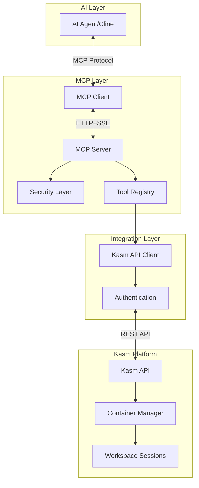
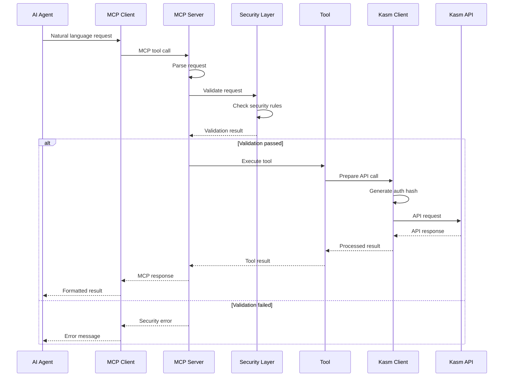
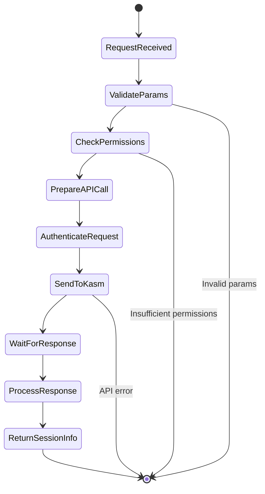
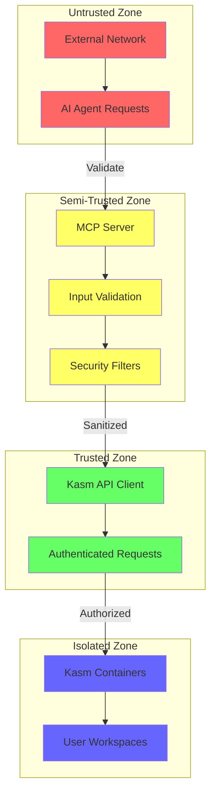
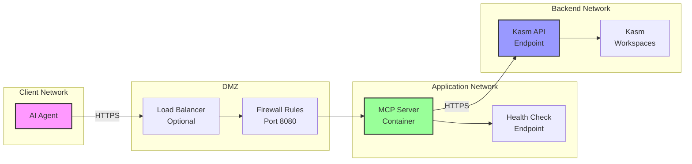

# Kasm MCP Server Architecture

## Table of Contents
1. [System Overview](#system-overview)
2. [Component Architecture](#component-architecture)
3. [Data Flow](#data-flow)
4. [Security Architecture](#security-architecture)
5. [Deployment Architecture](#deployment-architecture)

## System Overview

The Kasm MCP Server acts as a bridge between AI agents (like Cline) and Kasm Workspaces, providing secure, programmatic access to containerized desktop environments.

### High-Level Architecture



## Component Architecture

### Detailed Component Diagram

```
┌─────────────────────────────────────────────────────────────────────┐
│                         Kasm MCP Server                              │
├─────────────────────────────────────────────────────────────────────┤
│                                                                      │
│  ┌─────────────────┐  ┌─────────────────┐  ┌──────────────────┐   │
│  │   MCP Server    │  │  Tool Registry   │  │ Security Layer   │   │
│  │                 │  │                  │  │                  │   │
│  │ - HTTP+SSE      │  │ - Command Tools  │  │ - Roots Valid.   │   │
│  │ - JSON-RPC      │  │ - Session Tools  │  │ - Path Check     │   │
│  │ - Async Handler │  │ - Admin Tools    │  │ - Cmd Filter     │   │
│  └────────┬────────┘  └────────┬─────────┘  └────────┬─────────┘   │
│           │                    │                      │             │
│           └────────────────────┴──────────────────────┘             │
│                                │                                    │
│  ┌─────────────────────────────┴────────────────────────────────┐  │
│  │                      Core Engine                              │  │
│  │  ┌──────────────┐  ┌──────────────┐  ┌──────────────────┐  │  │
│  │  │ Request      │  │ Response     │  │ Error            │  │  │
│  │  │ Handler      │  │ Formatter    │  │ Handler          │  │  │
│  │  └──────────────┘  └──────────────┘  └──────────────────┘  │  │
│  └───────────────────────────────────────────────────────────────┘  │
│                                │                                    │
│  ┌─────────────────────────────┴────────────────────────────────┐  │
│  │                    Kasm API Client                            │  │
│  │  ┌──────────────┐  ┌──────────────┐  ┌──────────────────┐  │  │
│  │  │ Auth Manager │  │ API Wrapper  │  │ Connection Pool  │  │  │
│  │  │ (SHA256)     │  │              │  │                  │  │  │
│  │  └──────────────┘  └──────────────┘  └──────────────────┘  │  │
│  └───────────────────────────────────────────────────────────────┘  │
│                                                                      │
└─────────────────────────────────────────────────────────────────────┘
```

### Component Descriptions

#### 1. MCP Server (`src/server.py`)
- **Purpose**: Main entry point for MCP protocol handling
- **Responsibilities**:
  - Protocol implementation
  - Request routing
  - Response formatting
  - Connection management

#### 2. Tool Registry (`src/tools/`)
- **Purpose**: Manages available tools and their execution
- **Components**:
  - `command.py`: Execute commands in containers
  - `session.py`: Manage Kasm sessions and file operations
  - `admin.py`: Administrative functions

#### 3. Security Layer (`src/security/`)
- **Purpose**: Enforces security boundaries
- **Components**:
  - `roots.py`: MCP Roots implementation
  - Path validation
  - Command filtering
  - Input sanitization

#### 4. Kasm API Client (`src/kasm_api/`)
- **Purpose**: Interfaces with Kasm Workspaces API
- **Features**:
  - SHA256 authentication
  - Connection pooling
  - Error handling
  - Request/response mapping

## Data Flow

### Tool Execution Flow



### Session Creation Flow



## Security Architecture

### Security Layers

```
┌─────────────────────────────────────────────────────────────┐
│                    External Requests                         │
└─────────────────────────────────────────────────────────────┘
                              │
                              ▼
┌─────────────────────────────────────────────────────────────┐
│                 Layer 1: Transport Security                  │
│                                                              │
│  • HTTP+SSE with optional TLS                               │
│  • Connection authentication                                 │
│  • Rate limiting                                            │
└─────────────────────────────────────────────────────────────┘
                              │
                              ▼
┌─────────────────────────────────────────────────────────────┐
│              Layer 2: Protocol Validation                    │
│                                                              │
│  • MCP protocol compliance                                   │
│  • Schema validation                                         │
│  • Input sanitization                                        │
└─────────────────────────────────────────────────────────────┘
                              │
                              ▼
┌─────────────────────────────────────────────────────────────┐
│              Layer 3: Application Security                   │
│                                                              │
│  • MCP Roots enforcement                                     │
│  • Command filtering                                         │
│  • Path validation                                          │
│  • Blocked command list                                     │
└─────────────────────────────────────────────────────────────┘
                              │
                              ▼
┌─────────────────────────────────────────────────────────────┐
│               Layer 4: API Security                          │
│                                                              │
│  • SHA256 authentication                                     │
│  • API key management                                        │
│  • Request signing                                          │
└─────────────────────────────────────────────────────────────┘
                              │
                              ▼
┌─────────────────────────────────────────────────────────────┐
│            Layer 5: Container Isolation                      │
│                                                              │
│  • Kasm container boundaries                                 │
│  • Resource isolation                                        │
│  • Network segmentation                                      │
└─────────────────────────────────────────────────────────────┘
```

### Trust Boundaries



## Deployment Architecture

### Docker Deployment

```
┌─────────────────────────────────────────────────────────────┐
│                      Host System                             │
├─────────────────────────────────────────────────────────────┤
│                                                              │
│  ┌─────────────────────────────────────────────────────┐   │
│  │                 Docker Engine                        │   │
│  ├─────────────────────────────────────────────────────┤   │
│  │                                                      │   │
│  │  ┌───────────────────────────────────────────┐     │   │
│  │  │         kasm-mcp-server-v2:latest         │     │   │
│  │  ├───────────────────────────────────────────┤     │   │
│  │  │                                           │     │   │
│  │  │  • Python 3.11 Runtime                   │     │   │
│  │  │  • MCP Server Application                │     │   │
│  │  │  • Non-root user (mcp-user)             │     │   │
│  │  │  • Port 8080 exposed                     │     │   │
│  │  │                                           │     │   │
│  │  │  Volumes:                                │     │   │
│  │  │  - ./certs:/home/mcp-user/certs:ro      │     │   │
│  │  │                                           │     │   │
│  │  │  Environment:                            │     │   │
│  │  │  - KASM_API_URL                         │     │   │
│  │  │  - KASM_API_KEY                         │     │   │
│  │  │  - KASM_API_SECRET                      │     │   │
│  │  │  - ALLOWED_ROOTS                        │     │   │
│  │  └───────────────────────────────────────────┘     │   │
│  │                                                      │   │
│  │  ┌───────────────────────────────────────────┐     │   │
│  │  │           mcp-network (bridge)            │     │   │
│  │  └───────────────────────────────────────────┘     │   │
│  │                                                      │   │
│  └─────────────────────────────────────────────────────┘   │
│                                                              │
│  ┌─────────────────────────────────────────────────────┐   │
│  │                    systemd                           │   │
│  │  • kasm-mcp-server-v2.service                      │   │
│  │  • Auto-restart on failure                         │   │
│  │  • Logging to journal                              │   │
│  └─────────────────────────────────────────────────────┘   │
│                                                              │
└─────────────────────────────────────────────────────────────┘
```

### Network Architecture



## Scalability Considerations

### Horizontal Scaling

```
                    ┌─────────────────┐
                    │  Load Balancer  │
                    └────────┬─────────┘
                             │
        ┌────────────────────┼────────────────────┐
        │                    │                    │
┌───────▼──────┐    ┌────────▼──────┐    ┌───────▼──────┐
│ MCP Server 1 │    │ MCP Server 2  │    │ MCP Server N │
│              │    │               │    │              │
│ Container    │    │ Container     │    │ Container    │
└───────┬──────┘    └────────┬──────┘    └───────┬──────┘
        │                    │                    │
        └────────────────────┼────────────────────┘
                             │
                    ┌────────▼─────────┐
                    │   Kasm API       │
                    │   (Shared)       │
                    └──────────────────┘
```

### Performance Optimization

1. **Connection Pooling**: Reuse Kasm API connections
2. **Async Operations**: Non-blocking I/O for all operations
3. **Caching**: Cache workspace lists and user information
4. **Rate Limiting**: Prevent API exhaustion
5. **Health Checks**: Automatic failover support

## Monitoring and Observability

### Metrics Collection Points

```
┌─────────────────────────────────────────────────────────────┐
│                    Application Metrics                       │
├─────────────────────────────────────────────────────────────┤
│                                                              │
│  Request Metrics:           Security Metrics:               │
│  • Request count           • Blocked commands               │
│  • Response time           • Path violations                │
│  • Error rate              • Auth failures                  │
│  • Tool usage              • Rate limit hits                │
│                                                              │
│  System Metrics:           API Metrics:                     │
│  • CPU usage               • API call count                 │
│  • Memory usage            • API response time              │
│  • Connection count        • API error rate                 │
│  • Thread pool size        • Auth hash generation time      │
│                                                              │
└─────────────────────────────────────────────────────────────┘
```

## Future Architecture Considerations

1. **Message Queue Integration**: For async operations
2. **Database Backend**: For audit logging and state management
3. **Multi-Region Support**: Geographic distribution
4. **WebSocket Support**: Real-time bidirectional communication
5. **Plugin Architecture**: Extensible tool system
