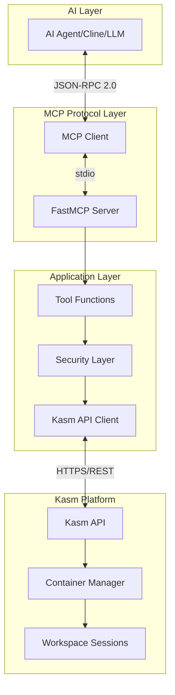
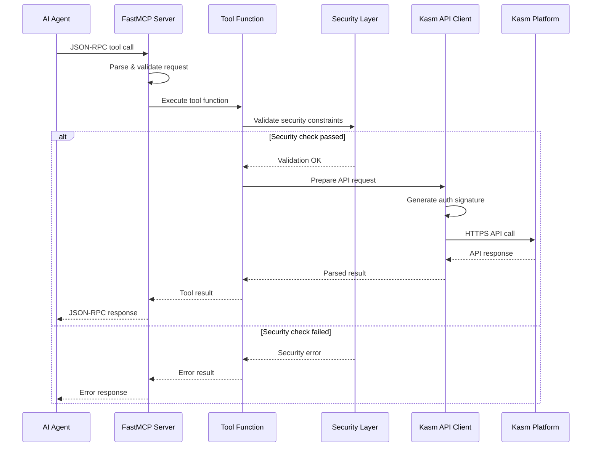
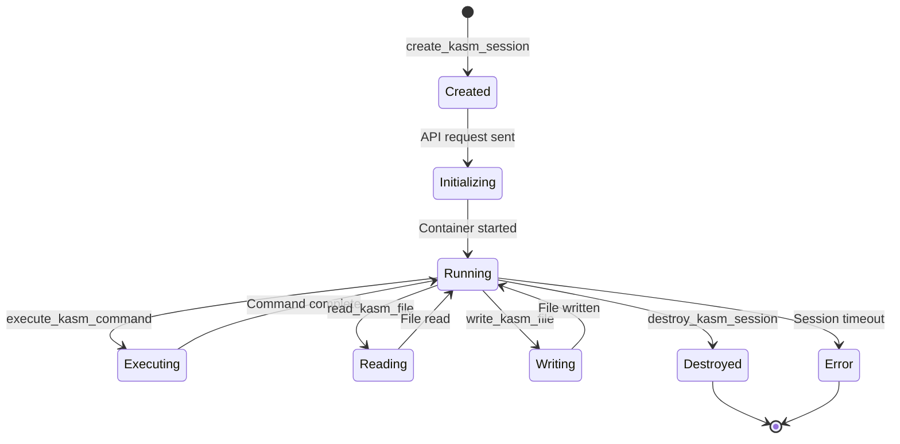
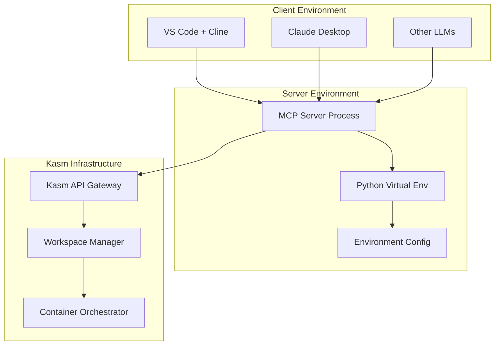

# Kasm MCP Server Architecture

## Table of Contents
1. [System Overview](#system-overview)
2. [Component Architecture](#component-architecture)
3. [Data Flow](#data-flow)
4. [Security Architecture](#security-architecture)
5. [Deployment Architecture](#deployment-architecture)
6. [Tool Implementation](#tool-implementation)

## System Overview

The Kasm MCP Server V2 acts as a bridge between AI agents (like Cline) and Kasm Workspaces, providing secure, programmatic access to containerized desktop environments through the Model Context Protocol.

### High-Level Architecture



## Component Architecture

### Core Components

```
┌─────────────────────────────────────────────────────────────────────┐
│                      Kasm MCP Server V2                             │
├─────────────────────────────────────────────────────────────────────┤
│                                                                      │
│  ┌─────────────────────────────────────────────────────────────┐   │
│  │                    FastMCP Server Core                       │   │
│  │                    (src/server.py)                          │   │
│  ├─────────────────────────────────────────────────────────────┤   │
│  │                                                              │   │
│  │  • FastMCP instance initialization                          │   │
│  │  • Tool registration via @mcp.tool() decorators             │   │
│  │  • Automatic JSON-RPC handling                              │   │
│  │  • Built-in error management                                │   │
│  │  • Stdio communication                                      │   │
│  │                                                              │   │
│  └──────────────────────────┬───────────────────────────────────┘   │
│                              │                                       │
│  ┌───────────────────────────▼───────────────────────────────────┐  │
│  │                     Tool Functions                            │  │
│  ├───────────────────────────────────────────────────────────────┤  │
│  │                                                               │  │
│  │  Session Management:        Command Execution:               │  │
│  │  • create_kasm_session      • execute_kasm_command           │  │
│  │  • destroy_kasm_session     • read_kasm_file                 │  │
│  │  • get_session_status       • write_kasm_file                │  │
│  │                                                               │  │
│  │  Admin Functions:           Utility Functions:               │  │
│  │  • get_available_workspaces • list_active_sessions           │  │
│  │  • get_kasm_users           • get_session_info              │  │
│  │  • create_kasm_user                                          │  │
│  │                                                               │  │
│  └──────────────────────────┬────────────────────────────────────┘  │
│                              │                                       │
│  ┌───────────────────────────▼───────────────────────────────────┐  │
│  │               Security & Validation Layer                     │  │
│  │                (src/security/roots.py)                        │  │
│  ├───────────────────────────────────────────────────────────────┤  │
│  │                                                               │  │
│  │  • MCP Roots enforcement                                      │  │
│  │  • Path validation and sanitization                          │  │
│  │  • Command filtering (blocked commands)                      │  │
│  │  • Input validation                                           │  │
│  │  • Security boundary checks                                   │  │
│  │                                                               │  │
│  └──────────────────────────┬────────────────────────────────────┘  │
│                              │                                       │
│  ┌───────────────────────────▼───────────────────────────────────┐  │
│  │                    Kasm API Client                            │  │
│  │                 (src/kasm_api/client.py)                      │  │
│  ├───────────────────────────────────────────────────────────────┤  │
│  │                                                               │  │
│  │  • SHA256 HMAC authentication                                 │  │
│  │  • Request signing and verification                          │  │
│  │  • Connection management                                      │  │
│  │  • Error handling and retries                                │  │
│  │  • Response parsing                                           │  │
│  │                                                               │  │
│  └───────────────────────────────────────────────────────────────┘  │
│                                                                      │
└─────────────────────────────────────────────────────────────────────┘
```

### Component Descriptions

#### 1. FastMCP Server Core (`src/server.py`)
- **Framework**: Uses FastMCP from the official MCP SDK
- **Initialization**: Simple `mcp = FastMCP(name="Kasm MCP Server")`
- **Tool Registration**: Decorators for clean tool definitions
- **Communication**: Handles stdio JSON-RPC automatically
- **Main Loop**: `mcp.run()` handles all protocol communication

#### 2. Tool Functions
Tools are defined as decorated async functions:

```python
@mcp.tool()
async def create_kasm_session(
    image_name: str,
    user_id: Optional[str] = None,
    enable_sharing: bool = False
) -> dict:
    """Create a new Kasm workspace session."""
    # Implementation
```

#### 3. Security Layer (`src/security/`)
- **roots.py**: Implements MCP Roots specification
- **Validation**: Path and command validation
- **Filtering**: Blocks dangerous commands
- **Boundaries**: Enforces workspace isolation

#### 4. Kasm API Client (`src/kasm_api/`)
- **client.py**: Handles all Kasm API interactions
- **Authentication**: SHA256 HMAC signing
- **Methods**: Wraps all Kasm API endpoints

## Data Flow

### Tool Execution Flow



### Session Lifecycle



## Security Architecture

### Security Layers

```
┌─────────────────────────────────────────────────────────────┐
│                    Input Layer                               │
│  • JSON-RPC request validation                              │
│  • Parameter type checking                                   │
│  • Schema validation                                        │
└──────────────────────────┬───────────────────────────────────┘
                           │
┌──────────────────────────▼───────────────────────────────────┐
│                 Application Security                         │
│  • MCP Roots enforcement                                     │
│  • Path traversal prevention                                │
│  • Command injection prevention                             │
│  • Blocked command filtering                                │
└──────────────────────────┬───────────────────────────────────┘
                           │
┌──────────────────────────▼───────────────────────────────────┐
│                    API Security                              │
│  • SHA256 HMAC authentication                               │
│  • Request signing                                          │
│  • TLS/HTTPS transport                                      │
│  • API key management                                       │
└──────────────────────────┬───────────────────────────────────┘
                           │
┌──────────────────────────▼───────────────────────────────────┐
│                Container Isolation                           │
│  • Kasm workspace boundaries                                │
│  • User permission model                                    │
│  • Resource isolation                                       │
│  • Network segmentation                                     │
└─────────────────────────────────────────────────────────────┘
```

### Security Rules

#### Blocked Commands
The following commands are blocked for security:
```python
BLOCKED_COMMANDS = [
    'rm -rf /', 'dd', 'mkfs', 'format',
    'fdisk', 'parted', 'shutdown', 'reboot',
    'init', 'systemctl', 'service', 'kill -9',
    'killall', 'pkill'
]
```

#### Path Validation
- All paths must be within allowed roots
- No path traversal (../) allowed
- Symbolic links are resolved and validated

## Deployment Architecture

### Installation Methods

```
┌─────────────────────────────────────────────────────────────┐
│                   Installation Options                       │
├─────────────────────────────────────────────────────────────┤
│                                                              │
│  1. Direct Python Installation                              │
│     └─> Virtual environment + pip install                   │
│                                                              │
│  2. NPM Package Installation                                 │
│     └─> npm install kasm-mcp-server                        │
│                                                              │
│  3. Docker Container                                        │
│     └─> docker run kasm-mcp-server:latest                  │
│                                                              │
│  4. Automated Script                                        │
│     └─> ./setup-prerequisites.sh                           │
│                                                              │
└─────────────────────────────────────────────────────────────┘
```

### Docker Architecture

```yaml
Container Structure:
├── Base Image: python:3.11-slim
├── Working Directory: /app
├── User: mcp-user (non-root)
├── Exposed Port: None (stdio communication)
├── Entry Point: python src/server.py
└── Environment Variables:
    ├── KASM_API_URL
    ├── KASM_API_KEY
    ├── KASM_API_SECRET
    └── LOG_LEVEL
```

### Production Deployment



## Tool Implementation

### Tool Categories

#### 1. Session Management Tools

```python
# Tool: create_kasm_session
Purpose: Creates new isolated workspace containers
Parameters:
  - image_name: Docker image for the workspace
  - user_id: Optional user identifier
  - enable_sharing: Allow session sharing
Returns: Session details including kasm_id, URL

# Tool: destroy_kasm_session
Purpose: Terminates an active workspace
Parameters:
  - kasm_id: Session identifier
Returns: Confirmation of termination

# Tool: get_session_status
Purpose: Retrieves current session state
Parameters:
  - kasm_id: Session identifier
Returns: Status information
```

#### 2. Command Execution Tools

```python
# Tool: execute_kasm_command
Purpose: Runs commands inside workspace
Parameters:
  - kasm_id: Session identifier
  - command: Shell command to execute
  - working_dir: Optional working directory
Security: Command filtering, path validation
Returns: Command output (stdout, stderr, exit_code)

# Tool: read_kasm_file
Purpose: Reads file contents from workspace
Parameters:
  - kasm_id: Session identifier
  - file_path: Path to file
Security: Path validation, size limits
Returns: File contents

# Tool: write_kasm_file
Purpose: Creates/updates files in workspace
Parameters:
  - kasm_id: Session identifier
  - file_path: Path to file
  - content: File contents
Security: Path validation, content sanitization
Returns: Write confirmation
```

#### 3. Administrative Tools

```python
# Tool: get_available_workspaces
Purpose: Lists available workspace images
Returns: List of images with metadata

# Tool: get_kasm_users
Purpose: Retrieves user information
Returns: User list with permissions

# Tool: create_kasm_user
Purpose: Provisions new user accounts
Parameters:
  - username: User identifier
  - password: User password
  - groups: Group memberships
Returns: User creation confirmation
```

## Performance Considerations

### Optimization Strategies

1. **Async Operations**: All tools use async/await for non-blocking I/O
2. **Connection Reuse**: Single Kasm API client instance
3. **Error Recovery**: Automatic retry with exponential backoff
4. **Resource Management**: Proper cleanup of sessions
5. **Logging**: Configurable log levels for debugging

### Scalability

- **Stateless Design**: Server maintains no session state
- **Horizontal Scaling**: Multiple server instances supported
- **Load Distribution**: Can work with load balancers
- **Resource Limits**: Configurable limits per session

## Monitoring and Observability

### Logging

```python
Log Levels:
- DEBUG: Detailed protocol messages
- INFO: Tool executions and results
- WARNING: Security violations, rate limits
- ERROR: API failures, exceptions
```

### Metrics

Key metrics to monitor:
- Tool execution count
- Average response time
- Error rate by tool
- Security violation count
- Active session count

## Future Enhancements

1. **WebSocket Support**: Real-time session monitoring
2. **Batch Operations**: Multiple session management
3. **Template System**: Pre-configured workspace templates
4. **Audit Trail**: Comprehensive activity logging
5. **Resource Quotas**: Per-user resource limits
6. **Session Persistence**: Save and restore workspace state
7. **Multi-Factor Auth**: Enhanced security options
8. **Webhook Integration**: Event-driven notifications

## Conclusion

The Kasm MCP Server V2 provides a secure, scalable bridge between AI systems and Kasm Workspaces. The architecture emphasizes:

- **Simplicity**: Using FastMCP for protocol handling
- **Security**: Multiple validation layers
- **Flexibility**: Multiple deployment options
- **Extensibility**: Easy to add new tools
- **Reliability**: Error handling and recovery

This design enables AI agents to safely and efficiently manage containerized workspaces while maintaining strict security boundaries.
