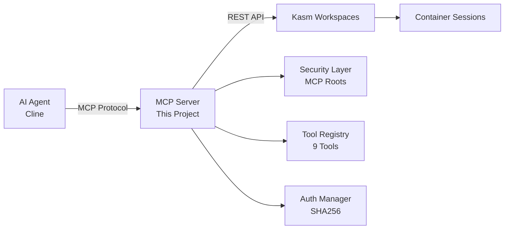

# Kasm MCP Server V2

[](https://mcp.tools)
[](https://opensource.org/licenses/MIT)
[](https://www.python.org/downloads/)
[](https://www.docker.com/)

A Model Context Protocol (MCP) server that provides programmatic access to Kasm Workspaces, enabling AI agents to manage and interact with containerized desktop infrastructure.

## 🚀 Installation

### Via MCP Tools Registry
```bash
# Coming soon on mcp.tools
mcp install kasm-mcp-server-v2
```

### Via npm (for package.json)
```bash
npm install @roguedev-ai/kasm-mcp-server-v2
```

## 📋 Documentation

- **[Architecture Documentation](ARCHITECTURE.md)** - Detailed system architecture with diagrams
- **[Security Documentation](SECURITY.md)** - Comprehensive security analysis and controls
- **[API Documentation](DOCUMENTATION.md)** - Complete API reference and examples

## Overview

This MCP server acts as a bridge between AI applications (like Cline) and the Kasm Workspaces platform, exposing a suite of tools for:
- Creating and managing Kasm sessions
- Executing commands within containers
- Reading and writing files in containers
- Managing users and workspaces

## Architecture



The server implements the MCP standard for secure, two-way communication between LLMs and external systems. It uses:
- Python with the official MCP SDK
- HTTP+SSE transport for remote connections
- Kasm Developer API for backend integration
- MCP Roots security mechanism for safe command execution

## Features

### 🛠️ Available Tools

#### Session Management
- `create_kasm_session`: Launch new Kasm sessions
- `destroy_kasm_session`: Terminate existing sessions
- `get_session_status`: Check session status

#### Command & File Operations
- `execute_kasm_command`: Execute shell commands with security boundaries
- `read_kasm_file`: Read files from containers
- `write_kasm_file`: Write files to containers

#### Administration
- `get_available_workspaces`: List available workspace images
- `get_kasm_users`: List users
- `create_kasm_user`: Create new users

## 🔒 Security

### Defense in Depth
```
External Request → Network Security → Protocol Validation → Command Security → API Security → Container Isolation
```

### Key Security Features
- **MCP Roots**: Enforces file system boundaries
- **Command Filtering**: Blocks dangerous commands
- **Path Validation**: Prevents directory traversal
- **Authentication**: SHA256-based API signing
- **Container Isolation**: Leverages Kasm's security
- **Rate Limiting**: Prevents abuse

See [SECURITY.md](SECURITY.md) for detailed security documentation.

## Installation

### Quick Start (Docker)

```bash
# Clone the repository
git clone https://github.com/roguedev-ai/kasm-mcp-server-v2.git
cd kasm-mcp-server-v2

# Set up environment variables
cp .env.example .env
# Edit .env with your Kasm API credentials

# Build and run with Docker
docker-compose up -d
```

### Remote Installation

```bash
curl -sSL https://raw.githubusercontent.com/roguedev-ai/kasm-mcp-server-v2/master/install.sh | bash
```

## Configuration

Required environment variables:
- `KASM_API_URL`: Your Kasm Workspaces API endpoint
- `KASM_API_KEY`: API key for authentication
- `KASM_API_SECRET`: API secret for authentication
- `MCP_SERVER_PORT`: Port for MCP server (default: 8080)
- `ALLOWED_ROOTS`: Comma-separated list of allowed root directories

## Usage

### With Cline/Claude Desktop

1. Add the server to your MCP settings configuration:

**For Cline (settings.json):**
```json
{
  "mcpServers": {
    "kasm": {
      "command": "python",
      "args": ["-m", "src"],
      "cwd": "/path/to/kasm-mcp-server-v2",
      "env": {
        "KASM_API_URL": "https://your-kasm-instance.com",
        "KASM_API_KEY": "your-api-key",
        "KASM_API_SECRET": "your-api-secret"
      }
    }
  }
}
```

**For Claude Desktop (claude_desktop_config.json):**
```json
{
  "mcpServers": {
    "kasm": {
      "command": "python",
      "args": ["-m", "src"],
      "cwd": "/path/to/kasm-mcp-server-v2",
      "env": {
        "KASM_API_URL": "https://your-kasm-instance.com",
        "KASM_API_KEY": "your-api-key",
        "KASM_API_SECRET": "your-api-secret"
      }
    }
  }
}
```

2. Use natural language to interact with Kasm:
   - "Create a new Ubuntu session and install git"
   - "Run a Python script in my Kasm container"
   - "Check the status of my active sessions"

## 🚀 Quick Start

### Using Docker (Recommended)
```bash
# Clone and configure
git clone https://github.com/roguedev-ai/kasm-mcp-server-v2.git
cd kasm-mcp-server-v2
cp .env.example .env
# Edit .env with your Kasm credentials

# Run with Docker Compose
docker-compose up -d
```

### Remote Installation
```bash
curl -sSL https://raw.githubusercontent.com/roguedev-ai/kasm-mcp-server-v2/master/install.sh | sudo bash
```

## Development

### Prerequisites
- Python 3.8+
- Docker (for containerized deployment)
- Access to a Kasm Workspaces instance

### Local Development
```bash
# Create virtual environment
python -m venv venv
source venv/bin/activate  # On Windows: venv\Scripts\activate

# Install dependencies
pip install -r requirements.txt

# Run tests
pytest

# Start the server
python -m src
```

### Project Structure
```
kasm-mcp-server-v2/
├── src/                    # Source code
│   ├── server.py          # Main MCP server
│   ├── kasm_api/          # Kasm API client
│   ├── security/          # Security implementation
│   └── tools/             # MCP tools
├── tests/                 # Unit tests
├── ARCHITECTURE.md        # Architecture diagrams
├── SECURITY.md           # Security documentation
└── DOCUMENTATION.md      # API documentation
```

## License

MIT License - See [LICENSE](LICENSE) file for details

## Contributing

Contributions are welcome! Please:
1. Fork the repository
2. Create a feature branch
3. Add tests for new functionality
4. Submit a pull request

## 🔐 Security

For security issues, please email security@roguedev.ai instead of using public issues.
