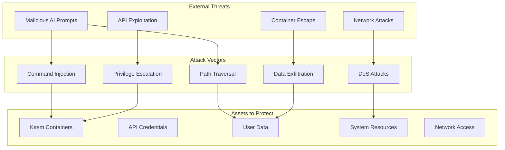
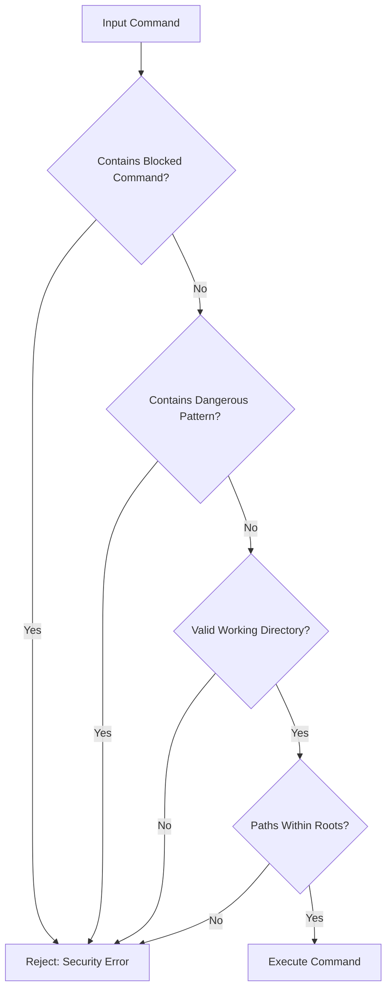
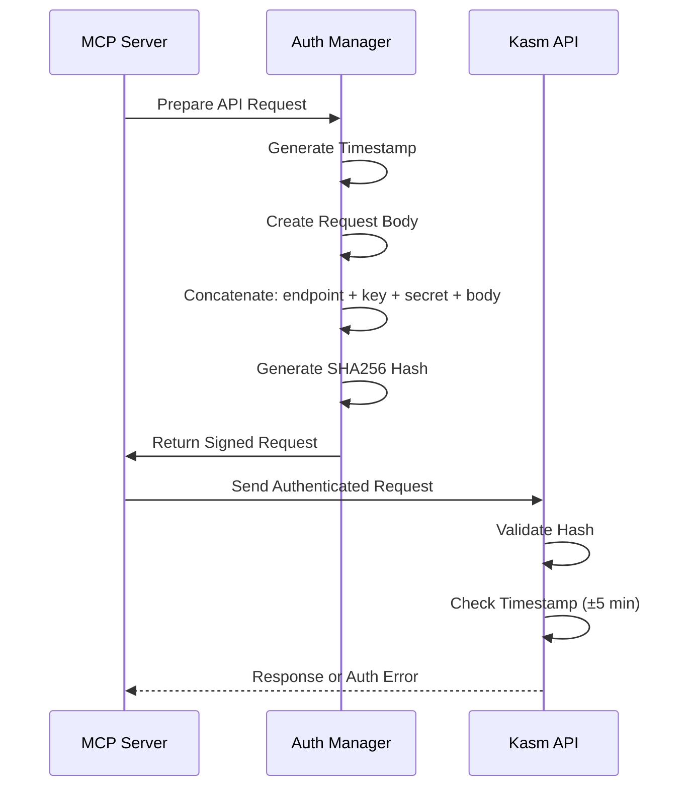
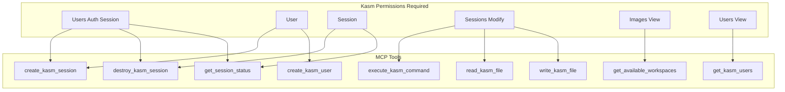
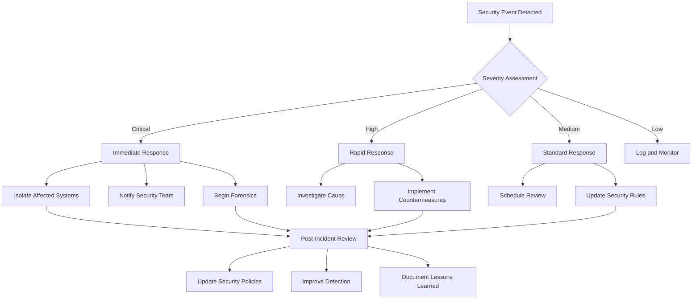

# Security Documentation - Kasm MCP Server

## Table of Contents
1. [Security Overview](#security-overview)
2. [Threat Model](#threat-model)
3. [Security Architecture](#security-architecture)
4. [Security Controls](#security-controls)
5. [Authentication & Authorization](#authentication--authorization)
6. [Input Validation](#input-validation)
7. [Security Best Practices](#security-best-practices)
8. [Incident Response](#incident-response)
9. [Security Checklist](#security-checklist)

## Security Overview

The Kasm MCP Server implements defense-in-depth security principles to protect against various attack vectors while enabling AI agents to interact with containerized environments safely.

### Security Principles

1. **Least Privilege**: Minimal permissions required for operation
2. **Defense in Depth**: Multiple security layers
3. **Zero Trust**: Verify everything, trust nothing
4. **Secure by Default**: Safe configurations out of the box
5. **Fail Secure**: Deny access on security failures

### Official MCP SDK Security Benefits

By using the official Model Context Protocol SDK, we gain additional security advantages:

- **Protocol Compliance**: Guaranteed adherence to MCP security standards
- **Validated Implementation**: SDK is tested and maintained by the MCP team
- **Security Updates**: Automatic security patches through SDK updates
- **Input Validation**: Built-in protocol-level validation
- **Secure Communication**: Standardized secure transport mechanisms

## Threat Model

### Attack Surface Analysis



### Threat Categories

#### 1. Input-Based Threats
- **Command Injection**: Malicious commands in AI requests
- **Path Traversal**: Accessing files outside allowed directories
- **SQL Injection**: N/A (no database in current design)
- **XSS**: N/A (no web interface)

#### 2. Authentication Threats
- **Credential Theft**: API keys exposure
- **Replay Attacks**: Reusing authentication tokens
- **Brute Force**: Attempting to guess credentials

#### 3. Container Threats
- **Container Escape**: Breaking out of Kasm container
- **Resource Exhaustion**: Consuming excessive resources
- **Privilege Escalation**: Gaining unauthorized permissions

#### 4. Network Threats
- **Man-in-the-Middle**: Intercepting communications
- **DoS/DDoS**: Overwhelming the service
- **Port Scanning**: Discovering attack surface

## Security Architecture

### Layered Security Model

```
┌─────────────────────────────────────────────────────────────┐
│                   Security Perimeter                         │
├─────────────────────────────────────────────────────────────┤
│                                                              │
│  ┌─────────────────────────────────────────────────────┐   │
│  │              Network Security Layer                   │   │
│  │                                                       │   │
│  │  • Firewall Rules (iptables/nftables)               │   │
│  │  • Rate Limiting (100 req/min default)              │   │
│  │  • TLS/SSL Encryption (optional)                    │   │
│  │  • IP Whitelisting (optional)                       │   │
│  └─────────────────────────────────────────────────────┘   │
│                            │                                 │
│  ┌─────────────────────────────────────────────────────┐   │
│  │           Application Security Layer                  │   │
│  │                                                       │   │
│  │  • Input Validation & Sanitization                   │   │
│  │  • MCP Protocol Validation                           │   │
│  │  • Schema Enforcement (Pydantic)                    │   │
│  │  • Error Handling (No Stack Traces)                 │   │
│  └─────────────────────────────────────────────────────┘   │
│                            │                                 │
│  ┌─────────────────────────────────────────────────────┐   │
│  │            Command Security Layer                     │   │
│  │                                                       │   │
│  │  • MCP Roots Enforcement                             │   │
│  │  • Command Whitelist/Blacklist                      │   │
│  │  • Path Validation                                   │   │
│  │  • Dangerous Pattern Detection                       │   │
│  └─────────────────────────────────────────────────────┘   │
│                            │                                 │
│  ┌─────────────────────────────────────────────────────┐   │
│  │              API Security Layer                       │   │
│  │                                                       │   │
│  │  • SHA256 HMAC Authentication                        │   │
│  │  • API Key Rotation Support                          │   │
│  │  • Request Signing                                   │   │
│  │  • Timestamp Validation                              │   │
│  └─────────────────────────────────────────────────────┘   │
│                            │                                 │
│  ┌─────────────────────────────────────────────────────┐   │
│  │           Container Security Layer                    │   │
│  │                                                       │   │
│  │  • User Namespace Isolation                          │   │
│  │  • Resource Limits (CPU/Memory)                      │   │
│  │  • Read-only Root Filesystem                         │   │
│  │  • No Privileged Containers                          │   │
│  └─────────────────────────────────────────────────────┘   │
│                                                              │
└─────────────────────────────────────────────────────────────┘
```

## Security Controls

### 1. Input Validation

#### Command Validation Flow



#### Blocked Commands
```python
BLOCKED_COMMANDS = {
    # System Administration
    'sudo', 'su', 'passwd', 'useradd', 'userdel', 'usermod',
    'groupadd', 'groupdel', 'groupmod', 'visudo',
    
    # Service Management
    'systemctl', 'service', 'init', 'systemd',
    
    # System Control
    'shutdown', 'reboot', 'halt', 'poweroff',
    
    # Dangerous File Operations
    'mkfs', 'fdisk', 'parted', 'mount', 'umount',
    
    # Network Utilities (when used maliciously)
    'nc', 'netcat', 'socat', 'nmap'
}
```

#### Dangerous Patterns
```python
DANGEROUS_PATTERNS = [
    # Directory Traversal
    r'\.\./|/\.\.',
    
    # Shell Redirections to Devices
    r'>\s*/dev/|<\s*/dev/',
    
    # System Files
    r'/etc/passwd|/etc/shadow|/etc/sudoers',
    
    # Kernel and Boot
    r'/boot/|/sys/|/proc/sys/',
    
    # Command Chaining (carefully evaluated)
    r';\s*rm\s+-rf|&&\s*rm\s+-rf',
    
    # Base64 Encoded Commands (suspicious)
    r'base64\s+-d.*\|.*sh|bash'
]
```

### 2. Path Security

#### MCP Roots Implementation

```
Allowed Roots Configuration:
├── /home/kasm_user/     (Default user directory)
├── /workspace/          (Shared workspace)
└── /tmp/user_*          (Temporary files)

Blocked Paths:
├── /etc/               (System configuration)
├── /root/              (Root user directory)
├── /boot/              (Boot partition)
├── /sys/               (System information)
├── /proc/              (Process information)
└── /dev/               (Device files)
```

#### Path Validation Logic

```python
def validate_path(path: str, allowed_roots: List[str]) -> bool:
    """
    Validates that a path is within allowed roots.
    
    Security checks:
    1. Resolve symlinks
    2. Normalize path (remove .., ., //)
    3. Check against allowed roots
    4. Prevent directory traversal
    """
    # Implementation in src/security/roots.py
```

### 3. Authentication Security

#### Kasm API Authentication Flow



#### Credential Storage Best Practices

1. **Environment Variables**: Never hardcode credentials
2. **File Permissions**: 600 for .env files
3. **Encryption at Rest**: Use OS keyring when possible
4. **Rotation**: Regular API key rotation
5. **Audit**: Log all authentication attempts

### 4. Container Security

#### Docker Security Configuration

```dockerfile
# Security best practices in Dockerfile
USER mcp-user                    # Non-root user
WORKDIR /home/mcp-user/app      # User-owned directory
ENV PYTHONDONTWRITEBYTECODE=1   # No .pyc files
ENV PYTHONUNBUFFERED=1          # Direct stdout

# Read-only root filesystem (docker-compose.yml)
read_only: true
tmpfs:
  - /tmp
  - /var/tmp
```

#### Resource Limits

```yaml
# docker-compose.yml security settings
services:
  kasm-mcp-server-v2:
    # Resource limits
    deploy:
      resources:
        limits:
          cpus: '2.0'
          memory: 2G
        reservations:
          cpus: '0.5'
          memory: 512M
    
    # Security options
    security_opt:
      - no-new-privileges:true
      - seccomp:unconfined
    
    # Capabilities (drop all, add only needed)
    cap_drop:
      - ALL
    cap_add:
      - NET_BIND_SERVICE
```

## Authentication & Authorization

### API Key Management

```
┌─────────────────────────────────────────────────────────────┐
│                   API Key Lifecycle                          │
├─────────────────────────────────────────────────────────────┤
│                                                              │
│  1. Generation:                                              │
│     • Use cryptographically secure random                    │
│     • Minimum 32 characters                                  │
│     • Include entropy from multiple sources                  │
│                                                              │
│  2. Storage:                                                 │
│     • Environment variables only                             │
│     • Never in code or config files                         │
│     • Encrypted in CI/CD systems                            │
│                                                              │
│  3. Transmission:                                            │
│     • Always over HTTPS                                      │
│     • Never in URLs or logs                                  │
│     • Use request headers or body                           │
│                                                              │
│  4. Rotation:                                                │
│     • Regular schedule (90 days recommended)                 │
│     • Immediate on compromise                                │
│     • Graceful transition period                            │
│                                                              │
│  5. Revocation:                                              │
│     • Immediate effect                                       │
│     • Audit trail maintained                                 │
│     • Notification system                                    │
│                                                              │
└─────────────────────────────────────────────────────────────┘
```

### Permission Model



## Input Validation

### Validation Layers

```
┌─────────────────────────────────────────────────────────────┐
│                 Input Validation Pipeline                    │
├─────────────────────────────────────────────────────────────┤
│                                                              │
│  1. Protocol Validation                                      │
│     └─> Valid JSON-RPC format                              │
│     └─> Correct method names                               │
│     └─> Required parameters present                         │
│                                                              │
│  2. Schema Validation (Pydantic)                            │
│     └─> Type checking                                       │
│     └─> Value constraints                                   │
│     └─> Format validation                                   │
│                                                              │
│  3. Business Logic Validation                               │
│     └─> Valid Kasm session IDs                             │
│     └─> Authorized user IDs                                │
│     └─> Allowed workspace images                           │
│                                                              │
│  4. Security Validation                                      │
│     └─> Command injection prevention                        │
│     └─> Path traversal prevention                          │
│     └─> Size limits enforcement                            │
│                                                              │
└─────────────────────────────────────────────────────────────┘
```

### Sanitization Rules

1. **Command Sanitization**
   - Strip leading/trailing whitespace
   - Remove null bytes
   - Escape shell metacharacters
   - Validate against whitelist when possible

2. **Path Sanitization**
   - Normalize paths (resolve .., ., //)
   - Remove null bytes
   - Validate against allowed roots
   - Check file existence and permissions

3. **String Sanitization**
   - Enforce maximum lengths
   - Remove control characters
   - Validate character encoding (UTF-8)
   - Escape special characters

## Security Best Practices

### Deployment Security

1. **Network Security**
   ```bash
   # Firewall rules (iptables example)
   iptables -A INPUT -p tcp --dport 8080 -m state --state NEW -m limit --limit 10/min -j ACCEPT
   iptables -A INPUT -p tcp --dport 8080 -j DROP
   ```

2. **TLS Configuration**
   ```yaml
   # Recommended TLS settings
   ssl_protocols: TLSv1.2 TLSv1.3
   ssl_ciphers: ECDHE-ECDSA-AES128-GCM-SHA256:ECDHE-RSA-AES128-GCM-SHA256
   ssl_prefer_server_ciphers: on
   ssl_session_cache: shared:SSL:10m
   ```

3. **Monitoring & Logging**
   ```python
   # Security event logging
   logger.warning(f"Security violation: {violation_type}", extra={
       'user_id': user_id,
       'command': sanitized_command,
       'timestamp': datetime.utcnow().isoformat(),
       'source_ip': request.remote_addr
   })
   ```

### Operational Security

1. **Access Control**
   - Implement RBAC for API access
   - Use separate API keys per environment
   - Audit all administrative actions
   - Implement session timeouts

2. **Monitoring**
   - Track failed authentication attempts
   - Monitor for suspicious command patterns
   - Alert on security violations
   - Regular security metric reviews

3. **Incident Response**
   - Automated alerting on security events
   - Clear escalation procedures
   - Forensic logging enabled
   - Regular incident drills

## Incident Response

### Security Incident Workflow



### Response Procedures

1. **Detection & Analysis**
   - Automated alerting systems
   - Log aggregation and analysis
   - Threat intelligence integration
   - Behavioral anomaly detection

2. **Containment**
   - Isolate affected containers
   - Revoke compromised credentials
   - Block malicious IPs
   - Preserve forensic evidence

3. **Eradication & Recovery**
   - Remove malicious artifacts
   - Patch vulnerabilities
   - Restore from clean backups
   - Verify system integrity

4. **Post-Incident**
   - Document timeline
   - Identify root cause
   - Update security controls
   - Share lessons learned

## Security Checklist

### Pre-Deployment Checklist

- [ ] All credentials stored in environment variables
- [ ] .env file has 600 permissions
- [ ] Docker running as non-root user
- [ ] Resource limits configured
- [ ] Firewall rules in place
- [ ] TLS certificates valid (if using HTTPS)
- [ ] Logging configured and tested
- [ ] Monitoring alerts configured
- [ ] Backup procedures documented
- [ ] Incident response plan reviewed

### Operational Checklist

- [ ] Regular security updates applied
- [ ] API keys rotated on schedule
- [ ] Security logs reviewed daily
- [ ] Anomaly detection active
- [ ] Access logs audited weekly
- [ ] Security metrics tracked
- [ ] Penetration testing scheduled
- [ ] Security training completed
- [ ] Compliance requirements met
- [ ] Disaster recovery tested

### Security Audit Points

1. **Code Security**
   - No hardcoded credentials
   - Input validation on all endpoints
   - Error messages don't leak information
   - Dependencies regularly updated

2. **Infrastructure Security**
   - Minimal attack surface
   - Defense in depth implemented
   - Monitoring and alerting active
   - Regular security assessments

3. **Operational Security**
   - Access controls enforced
   - Audit trails maintained
   - Incident response tested
   - Security awareness training

## Security Contact

For security concerns or vulnerability reports:
- Email: security@roguedev.ai
- GPG Key: [Public key fingerprint]
- Response Time: Within 24 hours for critical issues

Please follow responsible disclosure practices.
