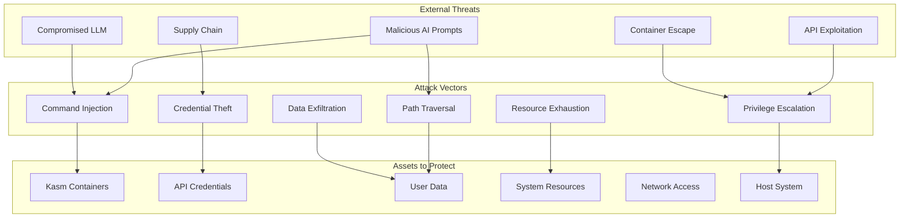
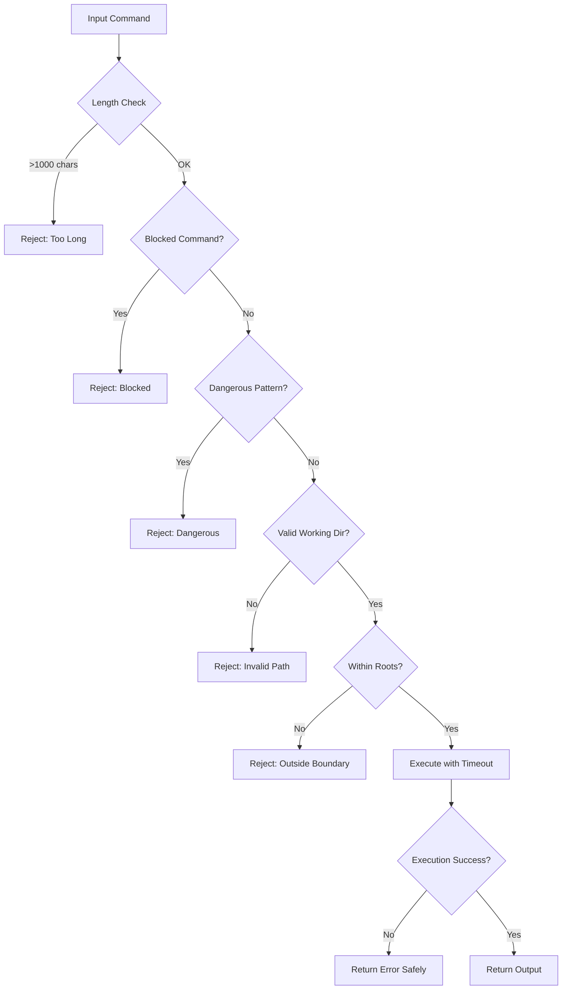
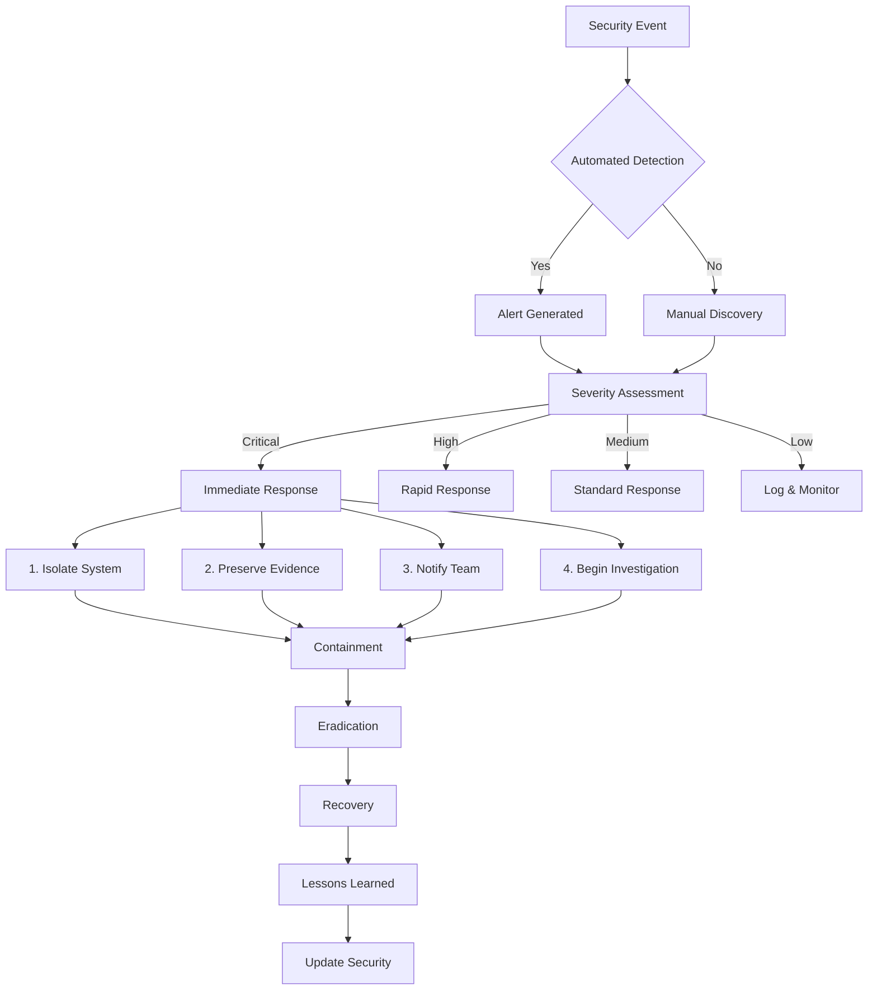

# Security Documentation - Kasm MCP Server V2

## Table of Contents
1. [Security Overview](#security-overview)
2. [Threat Model](#threat-model)
3. [Security Architecture](#security-architecture)
4. [Security Controls](#security-controls)
5. [Authentication & Authorization](#authentication--authorization)
6. [Input Validation](#input-validation)
7. [Installation Security](#installation-security)
8. [Security Best Practices](#security-best-practices)
9. [Incident Response](#incident-response)
10. [Security Checklist](#security-checklist)

## Security Overview

The Kasm MCP Server V2 implements defense-in-depth security principles to protect against various attack vectors while enabling AI agents to interact with containerized environments safely.

### Security Principles

1. **Least Privilege**: Minimal permissions required for operation
2. **Defense in Depth**: Multiple security layers
3. **Zero Trust**: Verify everything, trust nothing
4. **Secure by Default**: Safe configurations out of the box
5. **Fail Secure**: Deny access on security failures

### FastMCP Security Benefits

By using FastMCP from the official Model Context Protocol SDK, we gain:

- **Protocol Compliance**: Guaranteed adherence to MCP security standards
- **Built-in Validation**: Automatic parameter type checking and validation
- **Secure Communication**: Standardized JSON-RPC over stdio
- **Error Handling**: Safe error messages without information leakage
- **Regular Updates**: Security patches through SDK updates

## Threat Model

### Attack Surface Analysis



### Threat Categories

#### 1. Input-Based Threats
- **Command Injection**: Malicious commands embedded in AI requests
- **Path Traversal**: Accessing files outside allowed directories
- **Format String Attacks**: Exploiting string formatting functions
- **Buffer Overflow**: N/A (Python's memory management prevents this)

#### 2. Authentication Threats
- **Credential Theft**: API keys exposure through logs or errors
- **Replay Attacks**: Reusing authentication tokens
- **Man-in-the-Middle**: Intercepting API communications
- **Timing Attacks**: Extracting information from response times

#### 3. Container Threats
- **Container Escape**: Breaking out of Kasm container boundaries
- **Resource Exhaustion**: Consuming excessive CPU/memory
- **Privilege Escalation**: Gaining unauthorized permissions
- **Persistence**: Installing backdoors in containers

#### 4. Supply Chain Threats
- **Dependency Vulnerabilities**: Malicious or vulnerable packages
- **Image Tampering**: Compromised Docker images
- **Build Pipeline**: Compromised CI/CD systems
- **Installation Scripts**: Malicious code in setup scripts

## Security Architecture

### Layered Security Model

```
┌─────────────────────────────────────────────────────────────┐
│                   Security Perimeter                         │
├─────────────────────────────────────────────────────────────┤
│                                                              │
│  ┌─────────────────────────────────────────────────────┐   │
│  │           Protocol Security Layer (FastMCP)           │   │
│  │                                                       │   │
│  │  • JSON-RPC 2.0 validation                           │   │
│  │  • Method whitelist enforcement                      │   │
│  │  • Parameter type checking                           │   │
│  │  • Request size limits                               │   │
│  └─────────────────────────────────────────────────────┘   │
│                            │                                 │
│  ┌─────────────────────────────────────────────────────┐   │
│  │           Application Security Layer                  │   │
│  │                                                       │   │
│  │  • Input validation & sanitization                   │   │
│  │  • Command filtering & validation                    │   │
│  │  • Path boundary enforcement                         │   │
│  │  • Error message sanitization                        │   │
│  └─────────────────────────────────────────────────────┘   │
│                            │                                 │
│  ┌─────────────────────────────────────────────────────┐   │
│  │            MCP Roots Security Layer                   │   │
│  │                                                       │   │
│  │  • Directory access control                          │   │
│  │  • Path normalization                                │   │
│  │  • Symlink resolution                                │   │
│  │  • Traversal prevention                              │   │
│  └─────────────────────────────────────────────────────┘   │
│                            │                                 │
│  ┌─────────────────────────────────────────────────────┐   │
│  │              API Security Layer                       │   │
│  │                                                       │   │
│  │  • SHA256 HMAC authentication                        │   │
│  │  • Request signing & verification                    │   │
│  │  • Timestamp validation (±5 minutes)                 │   │
│  │  • TLS/HTTPS transport                              │   │
│  └─────────────────────────────────────────────────────┘   │
│                            │                                 │
│  ┌─────────────────────────────────────────────────────┐   │
│  │           Container Isolation Layer                   │   │
│  │                                                       │   │
│  │  • Kasm workspace boundaries                         │   │
│  │  • User namespace isolation                          │   │
│  │  • Resource limits (cgroups)                         │   │
│  │  • Network segmentation                              │   │
│  └─────────────────────────────────────────────────────┘   │
│                                                              │
└─────────────────────────────────────────────────────────────┘
```

## Security Controls

### 1. Command Execution Security

#### Command Validation Flow



#### Blocked Commands List
```python
BLOCKED_COMMANDS = {
    # System Administration
    'sudo', 'su', 'doas', 'passwd', 'chpasswd',
    'useradd', 'userdel', 'usermod', 'adduser', 'deluser',
    'groupadd', 'groupdel', 'groupmod', 'visudo',
    
    # Service Management
    'systemctl', 'service', 'init', 'systemd', 'rc-service',
    'sv', 'runsv', 'runsvdir', 'update-rc.d',
    
    # System Control
    'shutdown', 'reboot', 'halt', 'poweroff', 'init 0', 'init 6',
    'telinit', 'kexec',
    
    # Filesystem Operations
    'mkfs', 'fdisk', 'parted', 'mount', 'umount', 'fsck',
    'mkswap', 'swapon', 'swapoff', 'hdparm',
    
    # Kernel Modules
    'insmod', 'rmmod', 'modprobe', 'modinfo', 'lsmod',
    
    # Network Tools (when dangerous)
    'iptables', 'ip6tables', 'nft', 'firewall-cmd',
    'nc', 'netcat', 'socat', 'nmap', 'tcpdump'
}
```

#### Dangerous Pattern Detection
```python
DANGEROUS_PATTERNS = [
    # Directory Traversal
    r'\.\./|/\.\.', r'\.\.\\|\\\.\.', 
    
    # Shell Injection
    r'`[^`]*`', r'\$\([^)]*\)', r'\$\{[^}]*\}',
    
    # Redirection to Dangerous Locations
    r'>\s*/dev/(sda|hda|nvme|null|zero)',
    r'</dev/(random|urandom|zero)',
    
    # System Files
    r'/etc/(passwd|shadow|sudoers|group)',
    r'/boot/', r'/sys/', r'/proc/sys/',
    
    # Dangerous Command Chains
    r';\s*rm\s+-rf\s+/', r'&&\s*rm\s+-rf\s+/',
    r'\|\s*dd\s+of=/', r'curl.*\|\s*(bash|sh)',
    
    # Base64 Execution
    r'base64\s+-d.*\|\s*(bash|sh|python|perl)',
    r'echo\s+[A-Za-z0-9+/=]+\s*\|\s*base64\s+-d',
    
    # Fork Bombs
    r':\(\)\{:\|:&\};:', r'fork\s*\(\s*\)\s*while'
]
```

### 2. Path Security Implementation

#### MCP Roots Configuration

```python
# Default allowed roots (configurable via environment)
DEFAULT_ALLOWED_ROOTS = [
    "/home/kasm_user",      # User home directory
    "/workspace",           # Shared workspace
    "/tmp/mcp_",           # Temporary files (prefixed)
    "/var/tmp/mcp_"        # Variable temporary files
]

# Strictly blocked paths (cannot be overridden)
BLOCKED_PATHS = [
    "/etc",                # System configuration
    "/boot",               # Boot partition
    "/sys",                # Kernel interface
    "/proc",               # Process information
    "/dev",                # Device files
    "/root",               # Root home
    "/var/log",            # System logs
    "/usr/local/bin",      # System binaries
    "/usr/bin",            # User binaries
    "/bin",                # Essential binaries
    "/sbin",               # System binaries
    "/lib",                # System libraries
    "/lib64"               # 64-bit libraries
]
```

#### Path Validation Implementation

```python
def validate_path_security(path: str) -> bool:
    """
    Multi-layer path security validation.
    
    Security checks:
    1. Normalize path (resolve .., ., //)
    2. Resolve symbolic links
    3. Check against blocked paths
    4. Verify within allowed roots
    5. Check file permissions
    """
    # Implementation in src/security/roots.py
    normalized = os.path.normpath(path)
    resolved = os.path.realpath(normalized)
    
    # Check blocked paths
    for blocked in BLOCKED_PATHS:
        if resolved.startswith(blocked):
            return False
    
    # Check allowed roots
    for root in allowed_roots:
        if resolved.startswith(root):
            return True
    
    return False
```

### 3. Credential Security

#### Environment Variable Security

```bash
# Secure environment variable handling
# Never log or print credentials
export KASM_API_KEY="$(vault read -field=key secret/kasm)"
export KASM_API_SECRET="$(vault read -field=secret secret/kasm)"

# Use file permissions for .env
chmod 600 .env
chown $USER:$USER .env
```

#### Credential Storage Best Practices

1. **Development Environment**
   ```bash
   # Use .env file with proper permissions
   echo "KASM_API_KEY=dev_key_xxxx" > .env
   echo "KASM_API_SECRET=dev_secret_yyyy" >> .env
   chmod 600 .env
   ```

2. **Production Environment**
   ```bash
   # Use secrets management system
   # Option 1: HashiCorp Vault
   vault kv put secret/kasm api_key=xxx api_secret=yyy
   
   # Option 2: AWS Secrets Manager
   aws secretsmanager create-secret --name kasm-mcp-creds
   
   # Option 3: Kubernetes Secrets
   kubectl create secret generic kasm-creds \
     --from-literal=api-key=xxx \
     --from-literal=api-secret=yyy
   ```

## Installation Security

### Secure Installation Script Features

The `setup-prerequisites.sh` script implements several security measures:

#### 1. Checksum Verification
```bash
# Verify script integrity
SCRIPT_CHECKSUM="sha256:expected_hash_here"
if ! echo "$SCRIPT_CHECKSUM  $0" | sha256sum -c -; then
    echo "Script integrity check failed!"
    exit 1
fi
```

#### 2. Secure Download Practices
```bash
# Use HTTPS and verify certificates
curl -fsSL --proto '=https' --tlsv1.2 \
     --cert-status \
     https://example.com/resource

# Verify GPG signatures for downloads
gpg --verify file.sig file
```

#### 3. Permission Management
```bash
# Set restrictive permissions
umask 077  # Files: 600, Directories: 700

# Create secure directories
mkdir -p "$INSTALL_DIR"
chmod 700 "$INSTALL_DIR"

# Secure file creation
touch "$CONFIG_FILE"
chmod 600 "$CONFIG_FILE"
```

#### 4. User Privilege Checks
```bash
# Prevent running as root unless necessary
if [[ $EUID -eq 0 ]] && [[ "$1" != "--allow-root" ]]; then
   echo "This script should not be run as root!"
   exit 1
fi

# Use sudo only when required
if command -v sudo &> /dev/null; then
    SUDO="sudo"
else
    SUDO=""
fi
```

### Docker Security Configuration

#### Dockerfile Security
```dockerfile
# Use specific version tags, not latest
FROM python:3.11.7-slim-bookworm

# Create non-root user
RUN useradd -m -r -u 1001 -s /bin/bash mcp-user

# Set security labels
LABEL security.scan="enabled" \
      security.nonroot="true" \
      security.updates="auto"

# Drop capabilities
USER mcp-user

# Health check
HEALTHCHECK --interval=30s --timeout=3s \
  CMD python -c "import sys; sys.exit(0)" || exit 1
```

#### Docker Compose Security
```yaml
services:
  kasm-mcp-server:
    # Security configurations
    security_opt:
      - no-new-privileges:true
      - apparmor:docker-default
      - seccomp:unconfined
    
    # Read-only filesystem
    read_only: true
    tmpfs:
      - /tmp:noexec,nosuid,size=100M
      - /var/tmp:noexec,nosuid,size=100M
    
    # Drop all capabilities, add only needed
    cap_drop:
      - ALL
    cap_add:
      - CHOWN
      - SETUID
      - SETGID
    
    # Resource limits
    deploy:
      resources:
        limits:
          cpus: '2.0'
          memory: 2G
          pids: 100
        reservations:
          cpus: '0.5'
          memory: 512M
    
    # Network isolation
    networks:
      - mcp_network
    
    # User mapping
    user: "1001:1001"
```

## Security Best Practices

### Development Security

1. **Code Security**
   ```python
   # Use parameterized queries (if database added)
   # Never concatenate user input
   
   # Good
   command = ["ls", "-la", user_path]
   subprocess.run(command, check=True)
   
   # Bad
   command = f"ls -la {user_path}"
   os.system(command)  # Command injection risk
   ```

2. **Dependency Management**
   ```bash
   # Regular dependency updates
   pip list --outdated
   pip-audit  # Check for vulnerabilities
   
   # Use lock files
   pip freeze > requirements.lock.txt
   
   # Verify package signatures
   pip install --require-hashes -r requirements.txt
   ```

3. **Secret Scanning**
   ```bash
   # Pre-commit hooks
   pip install pre-commit
   pre-commit install
   
   # .pre-commit-config.yaml
   repos:
     - repo: https://github.com/Yelp/detect-secrets
       hooks:
         - id: detect-secrets
   ```

### Operational Security

#### Monitoring & Alerting

```python
# Security event logging
import logging
from datetime import datetime

security_logger = logging.getLogger('security')

def log_security_event(event_type: str, details: dict):
    security_logger.warning(
        f"SECURITY_EVENT: {event_type}",
        extra={
            'timestamp': datetime.utcnow().isoformat(),
            'event_type': event_type,
            'details': details,
            'severity': determine_severity(event_type)
        }
    )

# Usage
log_security_event('BLOCKED_COMMAND', {
    'command': sanitized_cmd,
    'user': user_id,
    'session': session_id
})
```

#### Rate Limiting

```python
from collections import defaultdict
from datetime import datetime, timedelta

class RateLimiter:
    def __init__(self, max_requests=100, window_minutes=1):
        self.max_requests = max_requests
        self.window = timedelta(minutes=window_minutes)
        self.requests = defaultdict(list)
    
    def is_allowed(self, identifier: str) -> bool:
        now = datetime.now()
        cutoff = now - self.window
        
        # Clean old requests
        self.requests[identifier] = [
            req_time for req_time in self.requests[identifier]
            if req_time > cutoff
        ]
        
        # Check limit
        if len(self.requests[identifier]) >= self.max_requests:
            return False
        
        self.requests[identifier].append(now)
        return True
```

## Incident Response

### Security Incident Workflow



### Response Procedures

#### 1. Detection & Analysis
- Monitor security logs continuously
- Set up alerts for anomalies
- Regular security scans
- Threat intelligence integration

#### 2. Containment
```bash
# Immediate containment script
#!/bin/bash

# Stop the service
systemctl stop kasm-mcp-server

# Revoke API credentials
./revoke_credentials.sh

# Block network access
iptables -A INPUT -s $SUSPICIOUS_IP -j DROP

# Preserve evidence
tar -czf evidence_$(date +%Y%m%d_%H%M%S).tar.gz \
    /var/log/kasm-mcp/ \
    /tmp/mcp_* \
    .env
```

#### 3. Eradication & Recovery
- Remove malicious artifacts
- Patch vulnerabilities
- Restore from clean backups
- Regenerate credentials
- Verify system integrity

#### 4. Post-Incident Activities
- Document timeline
- Identify root cause
- Update security controls
- Share lessons learned
- Update incident response plan

## Security Checklist

### Installation Security Checklist

- [ ] Script run with checksum verification
- [ ] Dependencies verified with signatures
- [ ] Installation directory permissions set to 700
- [ ] Configuration files set to 600
- [ ] Non-root user created for service
- [ ] Secure environment variables configured
- [ ] No hardcoded credentials
- [ ] Logging configured
- [ ] Error messages sanitized

### Pre-Deployment Checklist

- [ ] All credentials in environment variables
- [ ] .env file permissions set to 600
- [ ] Docker running as non-root user
- [ ] Container capabilities dropped
- [ ] Resource limits configured
- [ ] Read-only root filesystem
- [ ] Network segmentation in place
- [ ] TLS certificates valid (if applicable)
- [ ] Security scanning completed
- [ ] Penetration testing performed

### Operational Security Checklist

- [ ] Security updates applied weekly
- [ ] API keys rotated every 90 days
- [ ] Security logs reviewed daily
- [ ] Anomaly detection active
- [ ] Rate limiting configured
- [ ] Access logs audited weekly
- [ ] Backup encryption verified
- [ ] Incident response plan tested
- [ ] Security training completed
- [ ] Compliance requirements met

### Code Security Checklist

- [ ] Input validation on all endpoints
- [ ] Command injection prevention
- [ ] Path traversal prevention
- [ ] Error messages don't leak information
- [ ] Logging doesn't include credentials
- [ ] Dependencies updated and scanned
- [ ] Security headers configured
- [ ] CORS properly configured
- [ ] Request size limits enforced
- [ ] Timeout values configured

## Security Updates

### Vulnerability Reporting

For security vulnerabilities, please:

1. **DO NOT** create public GitHub issues
2. Email: security@roguedev.ai
3. Use GPG encryption if possible
4. Include:
   - Description of vulnerability
   - Steps to reproduce
   - Potential impact
   - Suggested fix (if any)

### Response Timeline

- **Critical**: Response within 4 hours
- **High**: Response within 24 hours
- **Medium**: Response within 72 hours
- **Low**: Response within 1 week

### Security Advisory Process

1. Vulnerability reported
2. Confirmation within response timeline
3. Fix developed and tested
4. Security advisory drafted
5. Coordinated disclosure
6. Patch released
7. Advisory published

## Compliance

### Standards Alignment

- **OWASP Top 10**: Addressed in design
- **CIS Controls**: Implemented where applicable
- **NIST Cybersecurity Framework**: Aligned
- **ISO 27001**: Best practices followed

### Audit Trail

All security-relevant events are logged:
- Authentication attempts
- Authorization decisions
- Command executions
- File operations
- Configuration changes
- Security violations

## Conclusion

Security is a continuous process. This document will be updated as new threats emerge and security practices evolve. Regular security reviews and updates are essential for maintaining a secure system.

For questions or concerns, contact: security@roguedev.ai
